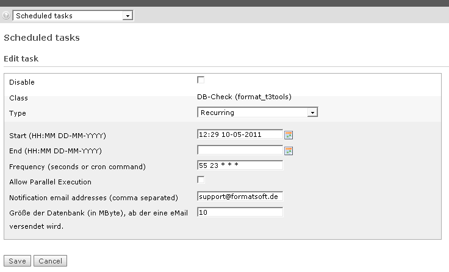

.. include:: ../Includes.txt

.. _introduction:

============
Introduction
============

.. _what-it-does:

What does it do?
================

Currently there are two checks available:
This TYPO3 extension checks the size of all database tables and/or the size of all log files at regular intervals.
On exceeding a certain size, a mail is sent.

There is a separate scheduler task for each check.

.. _screenshots:

Screenshots
===========

   Scheduler task settings of format_t3tools
